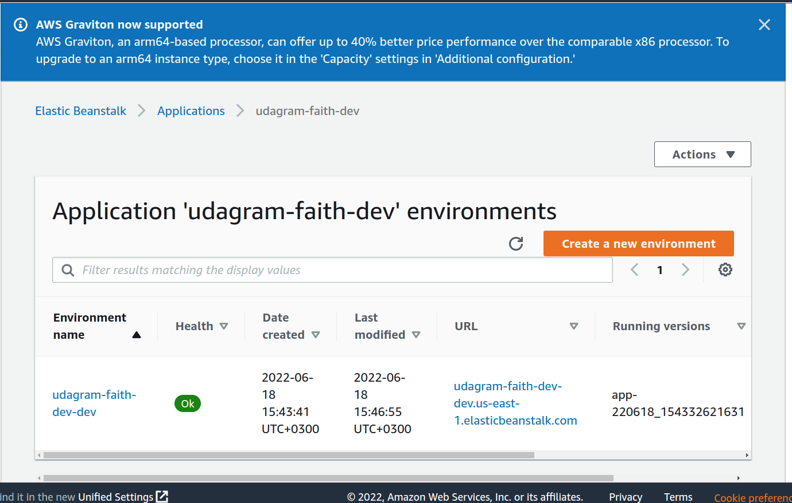

# Let’s talk deployment of a nodejs server on aws


**You have your webserver on and need to deploy to aws. How do you do it?**

This short article is a deep dive on deploying a web server on aws using elastic beanstalk.  It is a step-by-step guide on how I deployed a web application to AWS cloud. Before we get started,

**What is an aws Elastic Beanstalk?**

An elastic beanstalk is a powerful development tool used to deploy and scale web applications and services. It works like magic... You build, and upload your code and it automatically handles your deployment, from capacity provisioning, load balancing, and auto-scaling, to application health monitoring. As I said, it works like magic. Saves us a lot of lead time.

For this article, we will be working with this [code base](https://github.com/Faith-qa/ALX-Cloud-Developer/tree/master/Faith_Udagram_Project)


## Step 1: set up the EBS CLI [elastic beanstalk command line interface]

This will allow you work with the ebs from the commandline allowing. It provides a set of commands to enable us create a new application and deploy our code to EBS system.

To install EBS CLI, feel free to dive deep into the aws documentation [here](https://docs.aws.amazon.com/elasticbeanstalk/latest/dg/eb-cli3-install.html). To test if EBS CLI is successfully installed simply run the command `eb --version`. If it doesn’t work, restart your computer. A simple hark I learnt the hard way.

## Step 2:  provision and connect to aws elastic beanstalk from your command line

Before you jump into this, kindly ensure you’ve configured your aws account details  to your commandline using the AWS CLI. 

Once the above is done, simply type the command `eb init` in your project directory/repository. This will give you a few options like: 

1. *where you’d like to deploy,* 
2. *select and application name[nb it has to be unique within the aws console]*, 
3. *select the environment i.e the language your code base is in, often represented as an image.  for me it was nodejs, and aws automatically picked it up*
4. *Select whether you’d be using code commit or no, the default is always no. for me I did not need it.*
5. *Set up ssh instance. This allows you to tunnel into that computer and use it as though it were your own.*

And you are done.

This step automatically adds an elastic beanstalk directory/folder to your code base which contains a **config.yml file**. The config.yml file is important as it tells the amazon system how you want your system provisioned.

For my application I used an artifact build process as a result added the lines below to the config.yml:

        ```Deploy:
			artifact: ./www/Archive.zip
        ```
Choosing the artifact method is me telling aws that I would be building the code locally and it will be packaged on a single zip file which can be unpacked once uploaded.

## Step 3:  Transpile and package your code into a zip file

Do this by running the command npm run build, to create and package the code into the zip file, described in step 2.

Doing so, creates a `www folder` with the `Archive.zip` file and all the files needed. The zip file is what the **EB CLI** will be taking and using to provision your system.

## Step 4: Create an environment where your application will be provisioned and run

To do this, simply type eb create. This is followed up by series of questions such as:
1. *Environment name*
2. *DNS name to be included in the url provisioned for you…i.e the end point you’ll be using to access the application*
3. *Load balancer type to help route traffic to the instances running the application. For my case I chose the default load balancer which is the `application load balancer*`

Doing the above, uploads your code and creates a new instances environment with all of the infrastructures needed to run your applications.

## Step 5: you are done!
Yes you can access your application through the elastic beanstalk service. If all goes well, The deployed application should look like this in the Elastic Beanstalk of your AWS console:



